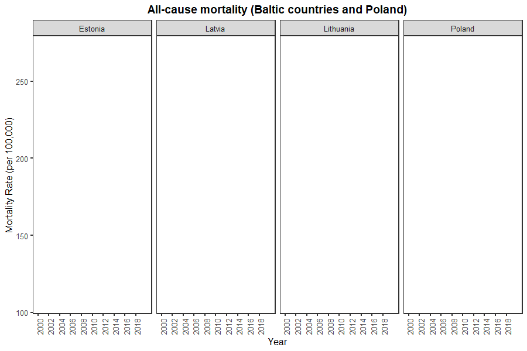
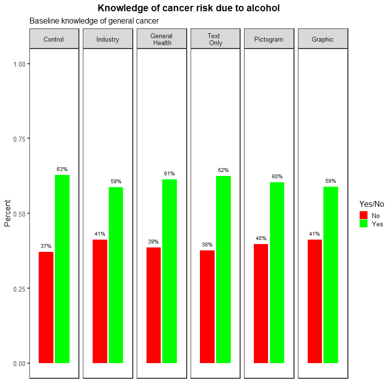
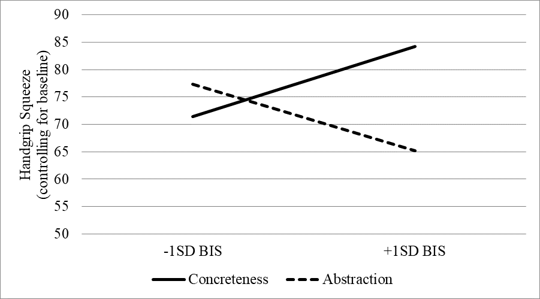

# Visualization of mortality rates between 4 countries 

# Visualization of changes in cancer knowledge following exposure to experimental manipulation 

# Breakdown of income groups in a large dataset (scalable) 

# Interaction effect of experimental condition on a personality moderator 

